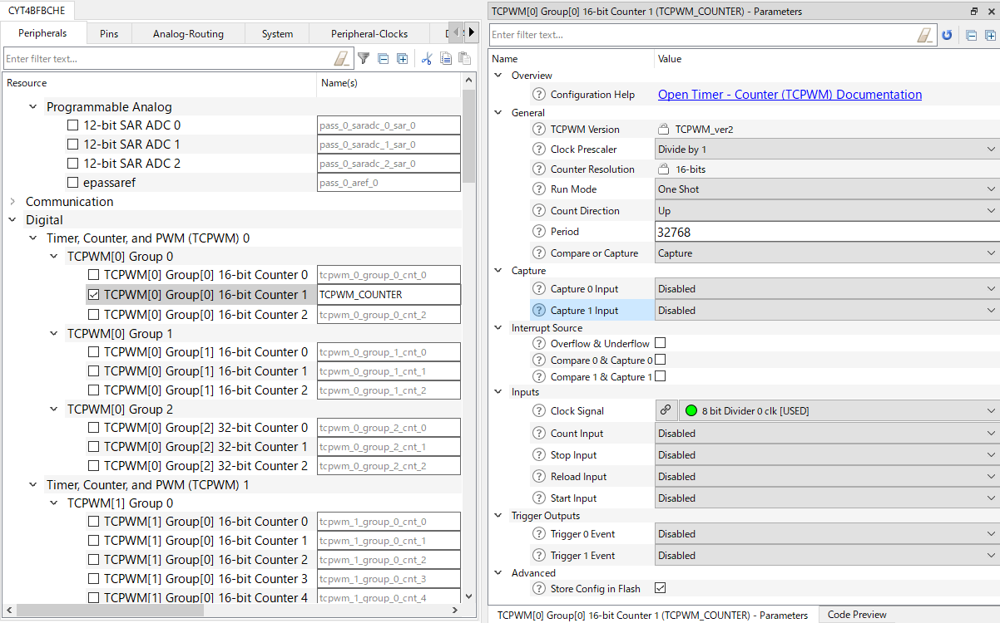

# INTERRUPT Software Interrupt
**This code example shows how to generate software interrupts and describes their operation, initialization, and interrupt handling.**  

## Device
The device used in this code example (CE) is:
- [TRAVEO™ T2G CYT4BF Series](https://www.infineon.com/cms/en/product/microcontroller/32-bit-traveo-t2g-arm-cortex-microcontroller/32-bit-traveo-t2g-arm-cortex-for-body/traveo-t2g-cyt4bf-series/)

## Board
The board used for testing is:
- TRAVEO™ T2G evaluation kit ([KIT_T2G-B-H_EVK](https://www.infineon.com/cms/en/product/evaluation-boards/kit_t2g-b-h_evk/), [KIT_T2G-B-H_LITE](https://www.infineon.com/cms/en/product/evaluation-boards/kit_t2g-b-h_lite/))

## Scope of work
In this example, software is used to generate an indirect interrupt, by setting the interrupt bit of a timer peripheral.

## Introduction  
**Interrupts**  
TRAVEO™ T2G platform supports the following interrupt features:
- Supports up to 1023 system interrupts
    - Eight Cortex-M7 external interrupts and eight Cortex-M7 internal (software only) interrupts. The CPU supports up to 
240 interrupts, but only sixteen interrupts are used by the TRAVEO™ T2G interrupt infrastructure. The eight external 
CPU interrupts support DeepSleep (WIC) functionality.
    - Eight Cortex-M0+ external interrupts and eight Cortex-M0+ internal (software only) interrupts. The CPU supports up to 
32 interrupts, but only sixteen interrupts are used by the TRAVEO™ T2G interrupt infrastructure. The eight external 
CPU interrupts support DeepSleep (WIC) functionality.
    - All the available system interrupt sources are usable in Active power mode and can wake up from Sleep power mode
    - A subset of available system interrupt sources capable of waking the device from DeepSleep power mode
    - Four system interrupts can be mapped to each of the CPU NMI
- Nested vectored interrupt controller (NVIC) integrated with each CPU core, yielding low interrupt latency
- Wakeup interrupt controller (WIC) enabling interrupt detection (CPU wakeup) in DeepSleep power mode
- Vector table may be placed in either flash or SRAM
- Configurable priority levels (eight levels for Cortex-M7 and four levels for Cortex-M0+) for each interrupt
- Level-triggered interrupt signals

More details can be found in [Technical Reference Manual (TRM)](https://www.infineon.com/dgdl/?fileId=5546d4627600a6bc017600bfae720007), [Registers TRM](https://www.infineon.com/dgdl/?fileId=5546d4627600a6bc017600be2aef0004) and [Data Sheet](https://www.infineon.com/dgdl/?fileId=5546d46275b79adb0175dc8387f93228).

## Hardware setup
This CE has been developed for:
- TRAVEO™ T2G evaluation kit ([KIT_T2G-B-H_EVK](https://www.infineon.com/cms/en/product/evaluation-boards/kit_t2g-b-h_evk/)) 
 
No changes are required from the board's default settings.

- TRAVEO™ T2G Body High Lite evaluation kit ([KIT_T2G-B-H_LITE](https://www.infineon.com/cms/en/product/evaluation-boards/kit_t2g-b-h_lite/)) 
 
No changes are required from the board's default settings.

## Implementation
This design consists of one TCPWM counter and one user LED. Interrupts can be generated by using software to set an interrupt flag in the timer resource. For this purpose, the timer is configured to allow software setting an interrupt request from the terminal. This interrupt is processed by an interrupt handler, which will toggle the user LED.

**STDIN / STDOUT setting**

Initialization of the GPIO for UART is done in the <a href="https://infineon.github.io/retarget-io/html/group__group__board__libs.html#gaddff65f18135a8491811ee3886e69707"><i>cy_retarget_io_init()</i></a> function.
- Initialize the pin specified by CYBSP_DEBUG_UART_TX as UART TX, the pin specified by CYBSP_DEBUG_UART_RX as UART RX (these pins are connected to KitProg3 COM port)
- The serial port parameters are set to 8N1 and 115200 baud

<a href="https://infineon.github.io/mtb-hal-cat1/html/group__group__hal__uart.html#ga89108b2d339dc9863ec660588e3a4a12"><i>cyhal_uart_getc()</i></a> returns the user input from the terminal as received data.

**GPIO port pin initialization**

Initialization of the GPIO port pin is done once in the <a href="https://infineon.github.io/mtb-hal-cat1/html/group__group__hal__gpio.html#gab93322030909d3af6a9fc1a3b2eccbaa"><i>cyhal_gpio_init()</i></a> function.
- Initialize the pin specified by *CYBSP_USER_LED2* as output (initial level = H, LED turns off)

**TCPWM initialization**

API calls for the TCPWM initialization is done in *init_Timer_Interrupt()* function.
- To initialize the TCPWM counter, <a href="https://infineon.github.io/mtb-pdl-cat1/pdl_api_reference_manual/html/group__group__tcpwm__functions__counter.html#ga6068a06ddc8a07c67bb6df86e920944c"><i>Cy_TCPWM_Counter_Init()</i></a> is called using structure <a href="https://infineon.github.io/mtb-pdl-cat1/pdl_api_reference_manual/html/structcy__stc__tcpwm__counter__config__t.html"><i>cy_stc_tcpwm_counter_config_t</i></a>. This is auto-coded by the Device Configurator, using the following arguments:

    - *Counter settings* 

- The counter is enabled by <a href="https://infineon.github.io/mtb-pdl-cat1/pdl_api_reference_manual/html/group__group__tcpwm__functions__counter.html#ga1707e2cc291fe486fbea346157c65bff"><i>Cy_TCPWM_Counter_Enable()</i></a>, and the terminal count interrupt is enabled by setting <a href="https://infineon.github.io/mtb-pdl-cat1/pdl_api_reference_manual/html/group__group__tcpwm__functions__common.html#ga47ec0d6214c01f67774fb97b9c3f0878"><i>Cy_TCPWM_SetInterruptMask()</i></a> using the mask value of *CY_TCPWM_INT_ON_TC*
- Next the interrupt handler is registered by using <a href="https://infineon.github.io/mtb-pdl-cat1/pdl_api_reference_manual/html/group__group__sysint__functions.html#gab2ff6820a898e9af3f780000054eea5d"><i>Cy_SysInt_Init()</i></a> and enabled via the *NVIC_EnableIRQ()* function

**Interrupt detection**

- if 'p' is pressed, <a href="https://infineon.github.io/mtb-pdl-cat1/pdl_api_reference_manual/html/group__group__tcpwm__functions__common.html#ga567d7ae9e63aed64f0c73e45183a4674"><i>Cy_TCPWM_SetInterrupt()</i></a> is used to set the interrupt flag of the configured counter. This will cause a peripheral interrupt in the CPU which will then be handled by the registered *handle_Counter_Interrupt_0()* function. The handler function clears the interrupt flag by using <a href="https://infineon.github.io/mtb-pdl-cat1/pdl_api_reference_manual/html/group__group__tcpwm__functions__common.html#ga0c7a2d667dc983c82327463529f5d283"><i>Cy_TCPWM_ClearInterrupt()</i></a> in the counter and toggles the state of the user LED2 by calling <a href="https://infineon.github.io/mtb-hal-cat1/html/group__group__hal__gpio.html#gacf9c6cb7d4f6f25828a62d44648b745d"><i>cyhal_gpio_toggle()</i></a>.

## Run and Test
For this example, a terminal emulator is required to display outputs and receive keys pressed. You can install a terminal emulator if you do not have one. In this example, [Tera Term](https://ttssh2.osdn.jp/index.html.en) was used as the terminal emulator.

After code compilation, perform the following steps to flash the device:
1. Connect the board to your PC using the provided USB cable through the KitProg3 USB connector.
2. Open a terminal program and select the KitProg3 COM port. Set the serial port parameters to 8N1 and 115200 baud.
3. Program the board using one of the following:
    - Select the code example project in the Project Explorer.
    - In the **Quick Panel**, scroll down, and click **[Project Name] Program (KitProg3_MiniProg4)**.
4. After programming, the code example starts automatically. Confirm that the messages are displayed on the UART terminal.

    - *Terminal output on program startup* 

5. You can debug the example to step through the code. In the IDE, use the **[Project Name] Debug (KitProg3_MiniProg4)** configuration in the **Quick Panel**. For details, see the "Program and debug" section in the [Eclipse IDE for ModusToolbox™ software user guide](https://www.infineon.com/dgdl/?fileId=8ac78c8c8386267f0183a8d7043b58ee).

**Note:** **(Only while debugging)** On the CM7 CPU, some code in *main()* may execute before the debugger halts at the beginning of *main()*. This means that some code executes twice: once before the debugger stops execution, and again after the debugger resets the program counter to the beginning of *main()*. See [KBA231071](https://community.infineon.com/t5/Knowledge-Base-Articles/PSoC-6-MCU-Code-in-main-executes-before-the-debugger-halts-at-the-first-line-of/ta-p/253856) to learn about this and for the workaround.

## References  
Relevant Application notes are:
- AN235305 - GETTING STARTED WITH TRAVEO™ T2G FAMILY MCUS IN MODUSTOOLBOX™
- [AN219842](https://www.infineon.com/dgdl/?fileId=8ac78c8c7cdc391c017d0d3a490a6732) - How to use interrupt in TRAVEO™ II
- [AN220224](https://www.infineon.com/dgdl/?fileId=8ac78c8c7cdc391c017d0d3a800a6752) - How to Use Timer, Counter, and PWM (TCPWM) in Traveo II Family

ModusToolbox™ is available online:
- <https://www.infineon.com/modustoolbox>

Associated TRAVEO™ T2G MCUs can be found on:
- <https://www.infineon.com/cms/en/product/microcontroller/32-bit-traveo-t2g-arm-cortex-microcontroller/>

More code examples can be found on the GIT repository:
- [TRAVEO™ T2G Code examples](https://github.com/orgs/Infineon/repositories?q=mtb-t2g-&type=all&language=&sort=)

For additional trainings, visit our webpage:  
- [TRAVEO™ T2G trainings](https://www.infineon.com/cms/en/product/microcontroller/32-bit-traveo-t2g-arm-cortex-microcontroller/32-bit-traveo-t2g-arm-cortex-for-body/traveo-t2g-cyt4bf-series/#!trainings)

For questions and support, use the TRAVEO™ T2G Forum:  
- <https://community.infineon.com/t5/TRAVEO-T2G/bd-p/TraveoII>  